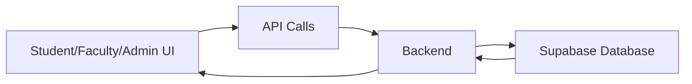

<h1 align="center">

  <br>
  CampusConnect : Unite.Learn.Grow
</h1>


## 📝 Description

CampusConnect is a smart college hub and event management system designed to cut through the noise, acting as the definitive single-source dashboard for campus life. It brings together every important update—official announcements, academic deadlines, club meetings, workshops, competitions, and career opportunities—into one cohesive and intuitive platform so students never have to hunt across multiple channels again.

Instead of scattered emails, notice boards, and group chats, CampusConnect centralizes all campus communication in real time. 
Students receive a personalized dashboard experience, where announcements are intelligently filtered based on the clubs they have joined, ensuring they only see relevant club updates while still staying informed about general and institutional announcements. This targeted visibility reduces clutter and makes information consumption far more efficient. 
Faculty and administrators gain a streamlined way to publish verified announcements, schedule events, and reach the right audience instantly, while organizers can manage registrations, reminders, and attendance from a single interface.

The platform also enhances engagement by helping students discover opportunities they might otherwise miss—guest lectures, hackathons, networking sessions, internships, and campus drives—through smart recommendations and timely notifications. CampusConnect transforms campus life from fragmented and overwhelming into organized and accessible.

At its core, CampusConnect is more than just an information board; it is a unified digital ecosystem that strengthens communication, boosts participation, and builds a more connected campus community.


## 🔗 Links

- [GitHub Repository](https://github.com/kavish310107/CampusConnect.git)
- [Demo Video](https://drive.google.com/drive/folders/1NtUoElXai_7HtNacuTA73ZZb4I8WvHmX)
- [Project Screenshots/Drive](https://drive.google.com/drive/folders/1NtUoElXai_7HtNacuTA73ZZb4I8WvHmX)
- [Hosted Website](https://campusconnect2-cyan.vercel.app)

## 🤖 Tech-Stack

- React + Vite
- JavaScript
- CSS
- Fetch API
- PostgreSQL (Supabase)

### 🏗️ System Architecture



### Front-end

-  React  
-  JavaScript  
-  HTML  
-  CSS

### Back-end

-  NodeJS  
-  ExpressJS  

### Database / Blockchain / ML (Optional Sections)

-  Supabase
-  PostgreSQL


## 💸 Applications

**Application Area** - Can be used by Colleges to act as a central Digital Platform for managing student life, communication, and activities inside the college.

## 🛠 Project Setup

1. Clone the GitHub repo.

```bash
git clone https://github.com/kavish310107/CampusConnect.git

```

2. Enter the project directory and install dependencies.

```bash
cd CampusConnect
npm install

```

3. Start the Frontend.

```bash
cd Frontend
npm run dev

```
4. Start the Backend.

```bash
cd Backend
npm start

```

